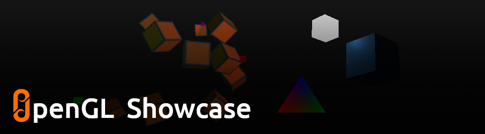

# OpenGL Showcase <!-- omit in toc -->



## Contents <!-- omit in toc -->

- [Introduction](#introduction)
- [Setup](#setup)
- [Build](#build)
  - [Supported Platforms](#supported-platforms)
  - [Dependencies](#dependencies)
  - [Build with CMake](#build-with-cmake)
- [Snapshots](#snapshots)
- [License](#license)

## Introduction 
 
OpenGL Showcase is the collection of all the examples from [LearnOpenGL](https://www.learnopengl.com).  
  
This project is for anyone who wants to see and experience all the cool things one can make by following the best opengl learning resource.  

I can't thank [Joey De Vries](http://joeydevries.com/#home) enough for making learnopengl.com.

## Setup 
 
Prerequisites: [git](https://git-scm.com/downloads) with [git large file storage (git-lfs)](https://docs.github.com/en/repositories/working-with-files/managing-large-files/installing-git-large-file-storage).

Clone the repo with submodules using the following command:

```
git clone --recurse-submodules https://github.com/oddStoneGames/OpenGLShowcase.git
cd OpenGLShowcase
```

## Build 
 
### Supported Platforms  
- Windows
- Linux

### Dependencies 
 
- Hardware with support for OpenGL 3.3 Core
- CMake v3.10+
- C++17 Compiler 
- On Linux, these [libraries](https://www.glfw.org/docs/latest/compile_guide.html) are required to build GLFW

### Build with CMake 
 
`Step 1.` Make a directory for the build files.

```
mkdir build
```

`Step 2.` Generate the project files.

```
cmake -S . -B ./build
```

`Step 3.` Build the project.

```
cmake --build build --config Release --target OpenGL-Showcase
```
`Step 4.` Run the executable OpenGL-Showcase which is located in the build or build/Release folder.

## Snapshots  


## License 
 
See [LICENSE](LICENSE).

This project has some third-party dependencies, each of which may have independent licensing:

- [assimp](https://github.com/assimp/assimp): A library to import and export various 3d-model-formats including scene-post-processing to generate missing render data.
- [glad](https://glad.dav1d.de/): Multi-Language GL/GLES/EGL/GLX/WGL Loader-Generator based on the official specs.
- [glfw](https://github.com/glfw/glfw): A multi-platform library for OpenGL, OpenGL ES, Vulkan, window and input
- [glm](https://github.com/g-truc/glm): OpenGL Mathematics
- [dear imgui](https://github.com/ocornut/imgui): Immediate Mode Graphical User Interface
- [stb](https://github.com/nothings/stb): Single-file public domain (or MIT licensed) libraries

All the images and models included in this project are made by me and are free to use.
- [Pistol Model](https://free3d.com/3d-model/beretta-pistol-459996.html)